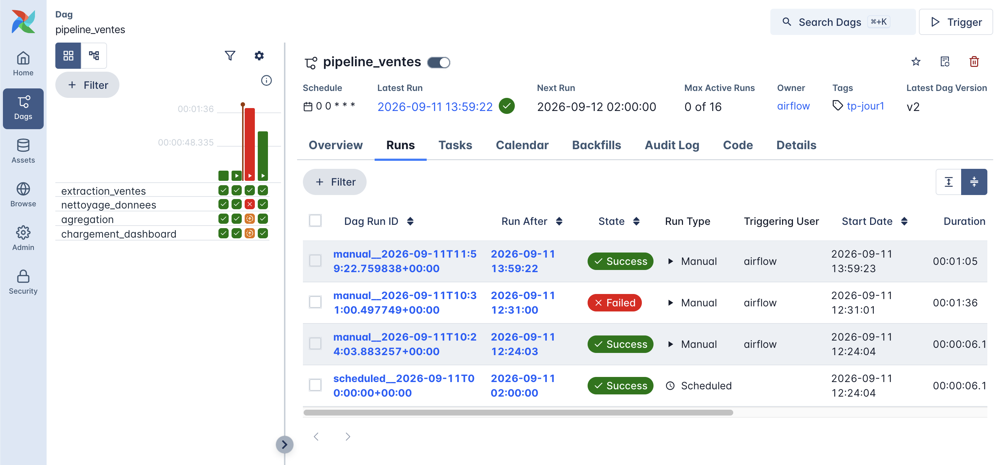
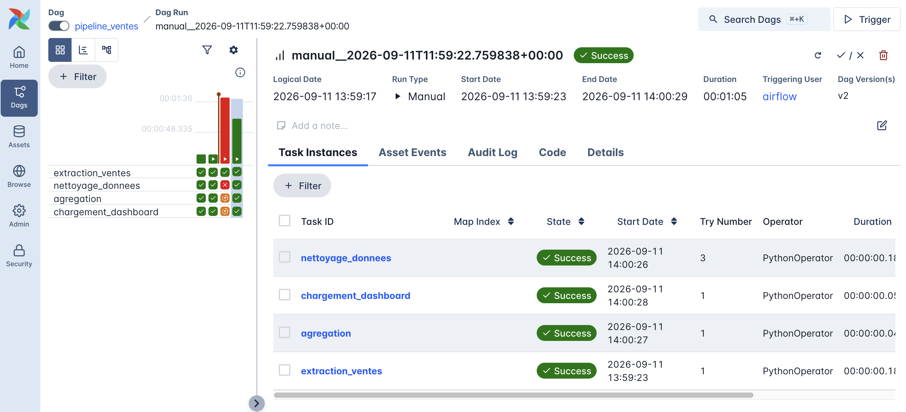
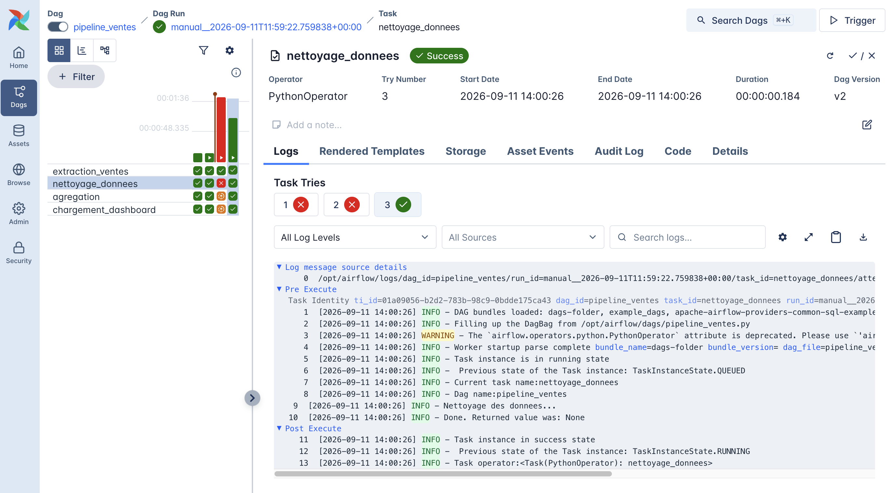
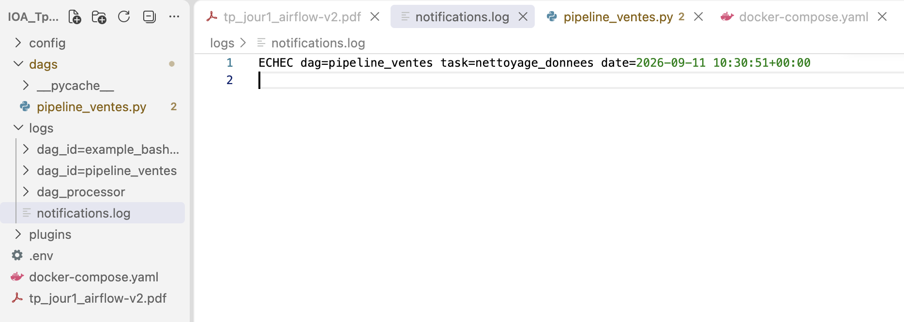

# Infrastructure Orchestration & Automation - TP Airflow

## Description

Ce projet documente le déploiement d'Apache Airflow via Docker Compose et la création d'un pipeline de données automatisé simulant un traitement de ventes. Il met en pratique la gestion des dépendances entre les tâches, la politique de reprise sur erreur et la traçabilité des processus de données.

## Prérequis

* Docker et Docker Compose installés et fonctionnels.
* Au moins 4 Go de RAM disponibles pour les conteneurs Airflow.

## Structure du Projet

* `docker-compose.yaml` : Fichier officiel démarrant les services nécessaires (scheduler, webserver, base de métadonnées).
* `.env` : Fichier d'environnement définissant les permissions de l'hôte (`AIRFLOW_UID`).
* `dags/pipeline_ventes.py` : Script Python contenant le graphe d'exécution (DAG) et les tâches du pipeline.
* `logs/notifications.log` : Fichier généré localement pour consigner les alertes en cas d'échec définitif.

## Installation et Démarrage

1. **Configurer les permissions (macOS/Linux)** :
   ```bash
   echo -e "AIRFLOW_UID=$(id -u)" > .env
   ```
2. **Initialiser l'environnement Airflow** :
   ```bash
   docker compose up airflow-init
   ```
3. **Lancer les conteneurs en arrière-plan** :
   ```bash
   docker compose up -d
   ```
4. **Accéder à l'interface web** :
   Ouvrez `http://localhost:8080` dans votre navigateur. Les identifiants par défaut sont `airflow` pour le nom d'utilisateur et le mot de passe.

## Fonctionnement du Pipeline (`pipeline_ventes`)

Le DAG orchestre quatre tâches de manière séquentielle :

1. **extraction_ventes** : Simule l'extraction depuis la source.
2. **nettoyage_donnees** : Simule le nettoyage des données avec une injection d'erreur aléatoire (60 % de probabilité) pour tester la gestion des pannes. Cette tâche intègre :
   * 3 tentatives de relance automatiques (`retries`).
   * Un délai d'attente de 30 secondes entre chaque essai (`retry_delay`).
   * Une notification (`on_failure_callback`) écrivant l'identifiant de l'erreur dans `notifications.log` si toutes les tentatives échouent.
3. **agregation** : Simule l'agrégation par région.
4. **chargement_dashboard** : Simule le chargement final vers la destination.

## Auditabilité et Traçabilité

Airflow conserve un historique complet pour prouver le bon fonctionnement des automatisations. Le détail des exécutions, la durée des tâches et l'historique des tentatives sont consultables depuis l'onglet **Task Instances** de l'interface web pour répondre aux exigences de conformité et d'audit.

## Questions

* **Quelle est la différence entre une task et un operator dans Airflow ?**
  Un *operator* définit le modèle de travail ou le type d'action à exécuter, tel que lancer une commande Bash ou exécuter du code Python. Une *task* est une instance spécifique de cet opérateur intégrée dans le graphe d'exécution de votre pipeline.
* **Pourquoi le DAG doit-il être acyclique (sans boucle) ?**
  Un pipeline Airflow possède un sens d'exécution unique et aucune boucle n'est possible. Si le système autorisait les boucles (cycles), les tâches pourraient s'attendre indéfiniment (dépendances circulaires), ce qui empêcherait le workflow de se terminer correctement.
* **Que se passe-t-il si retries=3 et que la tâche échoue à chaque tentative ? Combien de fois la fonction est-elle exécutée au total ?**
  La fonction est exécutée **4 fois** au total. L'exécution commence par un premier essai initial ; en cas d'échec, la tâche est automatiquement relancée jusqu'à 3 fois supplémentaires. Une fois les 3 tentatives de relance épuisées, la tâche est définitivement marquée comme en échec (Failed).
* **Pourquoi on_failure_callback n'est-il déclenché qu'après épuisement des tentatives, et pas à chaque essai ?**
  L'objectif de cette fonction est de notifier l'équipe d'un échec définitif de l'étape. Elle ne s'exécute qu'une seule fois après la dernière tentative échouée. Les échecs précédents, pris en charge par les `retries`, sont considérés comme des erreurs temporaires que le pipeline tente de résoudre automatiquement sans nécessiter d'alerte humaine.
* **En quoi l'historique conservé par Airflow contribue-t-il à la conformité et à l'auditabilité d'un traitement de données ?**
  Airflow conserve un historique complet et horodaté de chaque exécution (run), permettant de visualiser le statut individuel de chaque tâche ainsi que ses logs associés. Cette journalisation stricte garantit la traçabilité des opérations en documentant qui, quoi, et quand un processus s'est exécuté, constituant ainsi une preuve exploitable lors d'un audit.












